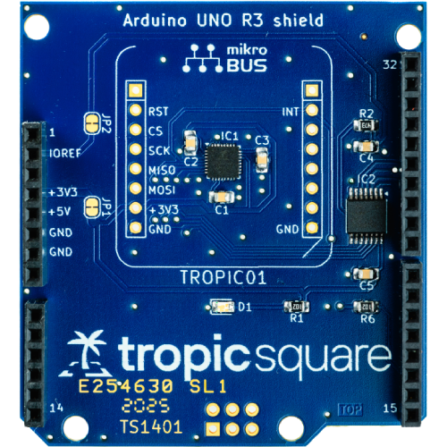

# TROPIC01 devboards
Welcome, PCB designers! 

This repository collects all resources for development boards which we designed with our TROPIC01 secure element. All PCB designs are freely available under **[CERN-OHL-P-2.0](https://ohwr.org/cernohl) Open Hardware license**. We encourage you to re-use designs, modify, or build your own boards!

> [!TIP]
> **Looking for code examples, ready to get started?** Head over to [libtropic](https://github.com/tropicsquare/libtropic) and pick a tutorial that matches your interests. Whether you're new to secure elements or building production systems, you'll find step-by-step guides to get you up and running quickly.

| Product name                      | HW resources                   | Description                           | Image  |
|:---------------------------------:|:------------------------------:|:-------------------------------------:|:------:|
| **TROPIC01 USB Devkit**           | [View](./TROPIC01_USB_Devkit/)          | For TROPIC01 evaluation over USB port     |  |
| **TROPIC01 Raspberry Pi Shield**  | [View](./TROPIC01_Raspberry_Pi_Shield/) | Shield for Raspberry Pi form factor   |  |
| **TROPIC01 Mini Board**           | [View](./TROPIC01_Mini_Board/)          | Compact PCB board                    |  |
| **TROPIC01 Arduino Shield**       | [View](./TROPIC01_Arduino_Shield/)      | Shield for Arduino form factor        |  |

## Using These Designs

Each particular board folder contains complete design files for all released revisions:
- **Schematics** (`.kicad_sch`) - Showing how components are wired together
- **PCB layouts** (`.kicad_pcb`) - Design of the PCB - how components are physically placed on the PCB
- **BOMs** - Component lists with part numbers
- **Gerbers** - Manufacturing files for PCB fabrication

You're free to use these as reference, modify for your needs, or manufacture your own boards.

> [!IMPORTANT]
> Some devboards include firmware in their folders. Note that firmware or its parts may be under various licensing schemes - see the [licensing section](#license) below for details.

## FAQ

See [FAQ.md](FAQ.md)

## Support & Warranty

These designs and devkits are provided as-is for evaluation and prototyping. No warranties are provided, and no production certifications (e.g., CE/FCC) are implied. Support is best-effort; for code examples and guidance, see [libtropic](https://github.com/tropicsquare/libtropic).

## License

This repository does not contain only PCB resources, but in some cases also HW which comes with devkit. Each part is under different license, more details in following table:

| Component        | License  | Applies To                                                                                          |
|:-----------------|:---------|:----------------------------------------------------------------------------------------------------|
| **PCB Hardware**            | [CERN-OHL-P-2.0](LICENSE.txt) | TROPIC01_Arduino_Shield/, TROPIC01_Raspberry_Pi_Shield/, TROPIC01_Mini_Board/, TROPIC01_USB_Devkit/PCB/ |
| **Firmware**                | [BSD-3-Clause-Clear](LICENSES/FIRMWARE-LICENSE.txt) | TROPIC01_USB_Devkit/firmwares/                         |
| **Third-party USB library** | Specific | TROPIC01_USB_Devkit/firmwares/firmware_B/sdk/ - See [LICENSES/NOTICE.txt](LICENSES/NOTICE.txt)    |

## About TROPIC01

For more information about the TROPIC01 secure element, please see the official documentation:

*   [TROPIC01 Development resources](https://github.com/tropicsquare/tropic01/tree/main/)
*   [TROPIC01 Website](https://www.tropicsquare.com/tropic01)
